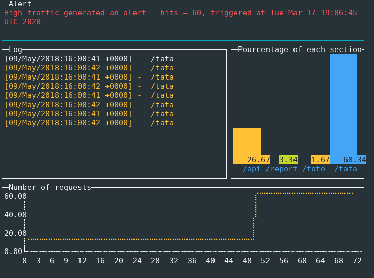

# Log dasboard

Allow to monitor input http request.
Display several stats about the most section hit, number request per second and a raw list of section found. 




## Getting Started

These instructions will get you a copy of the project up and running on your local machine for development and testing purposes. See deployment for notes on how to deploy the project on a live system.

### Prerequisites

Before starting make sure you have below packages installed:

- go version go1.13.1 linux/amd64
Optional:
- Docker version 18.09.7

### Installing

First, make sure your gitlab profil have a ssh key to allow `clone`

```
$ git clone git@github.com:Royalsspirit/dd-dm.git
```

### Usage

#### Makefile

You can run the project thanks to Makefile and docker by tyiping:

`$ make up`

It will take a locafile.log by default and a threshold of 10.

You can also override these values:

`$ make up threshold=20 logfile=/tmp/access.log`

#### Binary

You can find some help by typing:

`$ make help`

It should display:
```
Usage:
  -logfile string
    	a path of log file wanted to monitoring (default "./localfile.log")
  -threshold string
    	a threshold request per second (default "10")
```

If you don't want to use **Makefile**, you can also build binary as usually then run it:
```
$ go build -o ./bin/dd-monitoring ./cmd/cli && ./bin/dd-monitoring -threshold 20 -logfile /tmp/access.log
```

## Running the tests

`$ make test`

## Built With

- [termUi](https://github.com/gizak/termui) - Golang terminal dashboard
- [standard layoug](https://github.com/golang-standards/project-layout) - Standard Go Project Layout
- [daemon-golang](https://github.com/takama/daemon) - A daemon package for use with Go (golang) services with no dependencies
- [fsnotify](https://github.com/fsnotify/fsnotify) - Cross-platform file system notifications for Go

## Versioning

We use [SemVer](http://semver.org/) for versioning. For the versions available, see the [tags on this repository](https://github.com/your/project/tags).
